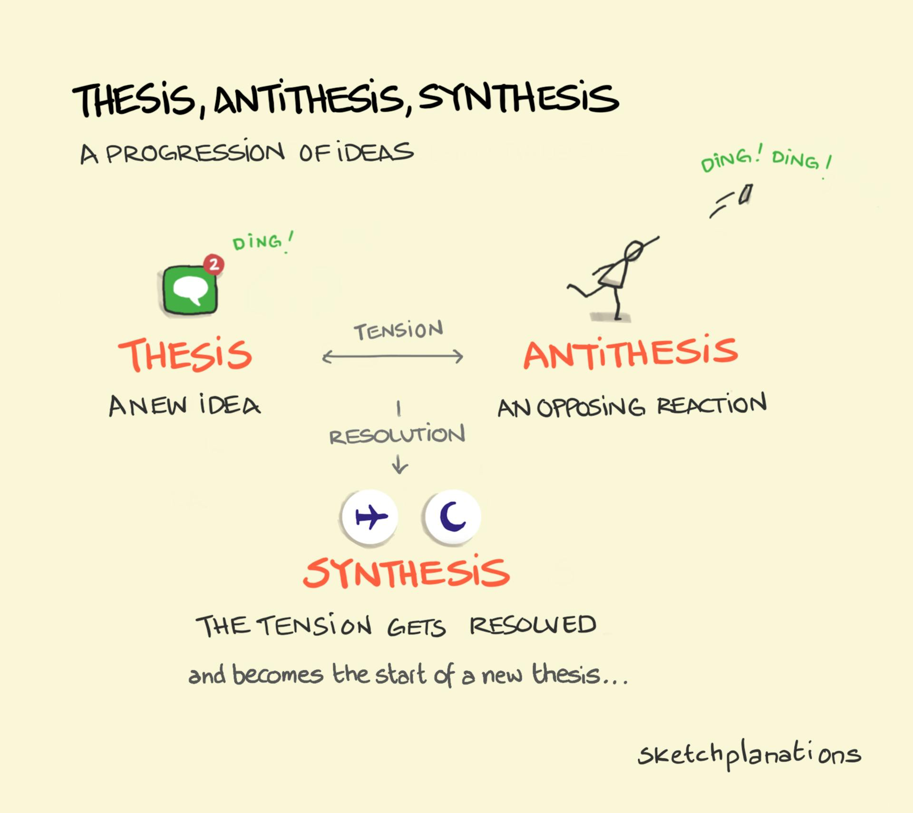
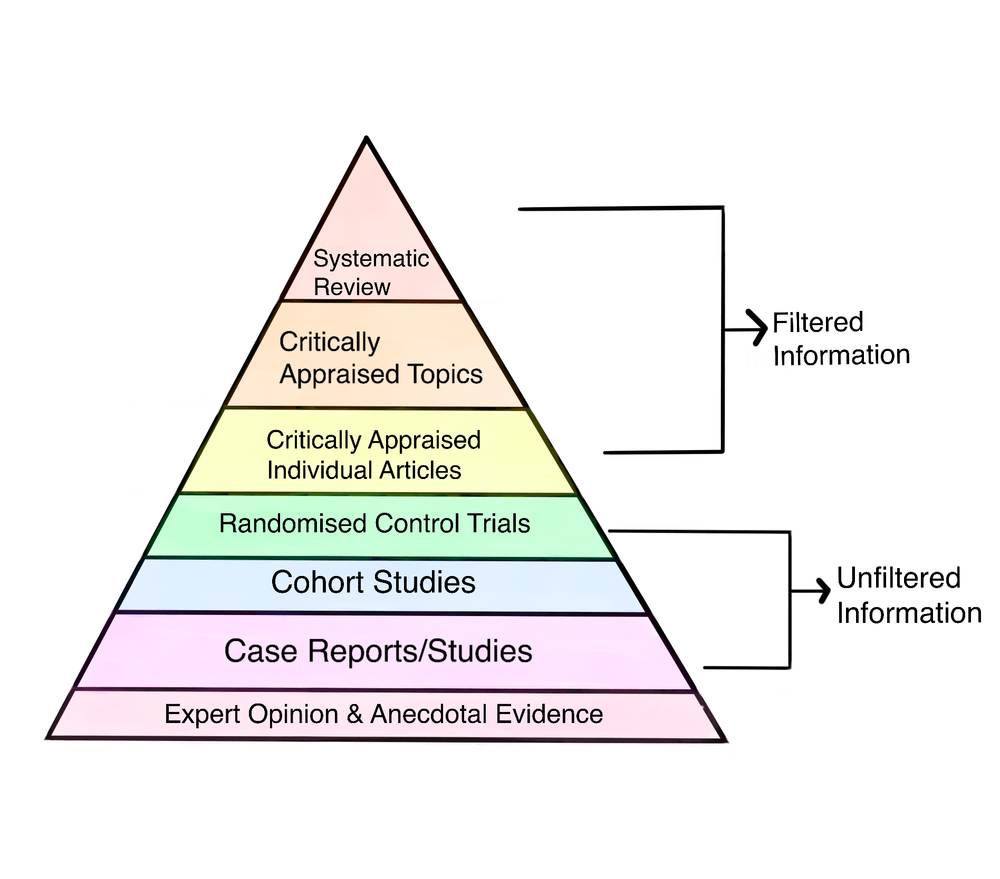

# palamedes

Rigorous LLM research, in two layers.

In Greek myth, Palamedes was the inventor of measurement and the one who exposed Odysseus's feigned madness. Odysseus framed him and had him stoned to death in revenge. Patron saint of "the clever one who catches the deceiver and loses anyway." The repo is named for him because the work has that shape: catching where a model is bluffing, anchoring claims to source text, refusing to let agreement between agents count as evidence when the agents share priors.

This repo merges two previous projects:

- **`research-synthesis-prompt`** (May 7 to 15, 2026): a multi-agent dialectic synthesis prompt iterated across four major versions, each adversarially reviewed. Lives at [`prompts/`](./prompts/).
- **`ai-research`** (May 14 to 16, 2026): an agent-loadable skill that gives an LLM coding agent the same epistemic discipline at the *coding-task* level rather than the *research-report* level. Lives at [`skill/`](./skill/).

Both share the same core methodology (process-based evaluation, verbatim source quoting, hierarchy of evidence, dialectic adversarial review, recognition that consensus across similar models is not independence). The two surfaces are different lift points.

---

## Which one to use

| If you are... | Use |
|---|---|
| A human running a one-off deep-research workflow across multiple LLMs | [`prompts/research-synthesis.md`](./prompts/research-synthesis.md) then [`prompts/adversarial-review.md`](./prompts/adversarial-review.md) |
| Using Claude / Cursor / Windsurf and want the agent to do research the rigorous way whenever it is asked to "research" or "investigate" or "fact-check" | [`skill/SKILL.md`](./skill/SKILL.md) loaded as a skill or rule |
| Both | Both. They compose. |

---

## The prompts (`prompts/`)



*[Thesis, Antithesis, Synthesis](https://sketchplanations.com/thesis-antithesis-synthesis) by Sketchplanations, [CC BY-NC 4.0](https://creativecommons.org/licenses/by-nc/4.0/)*

A multi-agent research prompt iterated over several months to produce epistemic research reports. Each run coordinates three independent LLM research agents, then passes their combined output to a separate adversarial synthesis agent before anything reaches the report. Process-based evaluation: each reasoning step is validated before the next one runs. The system can't surface a high-confidence claim without showing the source text that backs it, and it is instructed to adversarially self-review, to disconfirm instead of just taking everything it outputs as truth.

Cross-agent disagreements surface as `[CONFLICT]` flags and the agent is instructed to evaluate against a confidence matrix that has source tiers, hierarchy of evidence epistemology, and basic frequentist and Bayesian statistical rigor baked in, along with a cursory analysis of methodology best practices.

The part that took the most work was building in the understanding that three agents agreeing does not mean three independent data points. Just because all the people at your gym drink pre-workout does not mean that the 2000% of your DV of taurine they are taking will be anything more than placebo effect. The goal is to incorporate skepticism rather than normalize global confusion.

The output is an HTML research report with a sticky navigation TOC, theoretical foundations section, tactical implementation guide, inline evidence ledger, and a summary block in atomic `CLAIM / CONFIDENCE / SOURCE / QUOTE / STATUS` format, grouped by `[AGREEMENT]`, `[CONFLICT]`, and `[SINGLE SOURCE]`.

### Architecture

**Verifier model.** A dedicated synthesis agent checks whether claims are supported by cited sources. Claim generation and claim verification are separate steps. The same model that produced a claim does not get to decide whether it is trustworthy.

**Structured uncertainty.** Claims that can't be anchored to source text get held, not surfaced. Claims rated at ≥70 confidence require a verbatim excerpt from the source. If that excerpt is reconstructed from memory rather than direct text, it is labeled `[QUOTE UNVERIFIED]`. Explicit guardrail against hallucination.

**Meta-evaluation loop.** I calibrated the prompt against topics with known ground truths from exercise science, then adjusted confidence thresholds until scores tracked actual accuracy. Each version got an adversarial review where I identified weaknesses, patched them, and built the next version on top.

**Consensus ≠ compounded confidence.** Three agents citing the same three papers is one data point. The synthesis agent flags shared citation bases explicitly so downstream agents do not overweight replicated-looking evidence. Only true replication gets a bonus, and that is still less weight than a well-designed meta-analysis with a bunch of RCTs as sources.

**Temporal gate.** Claims where the primary evidence may fall within 12 months of an LLM's training cutoff are labeled `[RECENCY RISK]` and treated as provisional until verified against live sources.

### Evidence methodology



*[Hierarchy of Evidence](https://commons.wikimedia.org/wiki/File:Drawn_image_illustrating_the_Hierarchy_of_Evidence.png) by Wikimedia contributors, [CC BY-SA 4.0](https://creativecommons.org/licenses/by-sa/4.0/)*

Every source is classified by study design before a confidence score is assigned. The tier is the ceiling; quality issues (underpowered study, suspected HARKing, high COI) reduce from there.

| Study design tier | Confidence ceiling |
|---|---|
| Meta-analysis, I² < 50%, funnel symmetry reported | 95 |
| Multiple RCTs or systematic review, I² < 75% | 85 |
| Single unreplicated RCT → flagged `[SINGLE-RCT]` | 70 |
| Cross-sectional or case-control | 60 |
| Expert opinion or case study only | 45 |

Per-source checks: pre-registration (ClinicalTrials.gov / PROSPERO / OSF), statistical power (N ≥ 30 per group, power analysis), effect size required alongside p-values for ≥70 claims, HARKing detection, and full meta-analysis quality checklist (I², fixed vs. random effects model, funnel plot symmetry, RCT double-counting, CI interpretation).

### Usage

Paste [`prompts/research-synthesis.md`](./prompts/research-synthesis.md) as the system prompt. Replace `{{RESEARCH_TOPIC}}`. Run three agents in parallel, then pass all three outputs to a fourth synthesis agent running the same prompt.

After synthesis, copy the `<summary>` block from the output and paste it into [`prompts/adversarial-review.md`](./prompts/adversarial-review.md). That stage starts from finished claims and tries to break them, not continue building on them. Two modes: Mode A runs all eight phases in one pass against a live-web-capable model; Mode B generates five self-contained prompts you distribute across capability classes (live-web search, strong reasoning, highest-reasoning long-context synthesis). Prompt 5 is always the final step regardless of how you ran the others.

The two stages are doing different work: synthesis finds sources and builds a picture; the adversarial pass comes in after and tries to poke holes.

---

## The skill (`skill/`)

[`skill/SKILL.md`](./skill/SKILL.md) is a self-contained agent-loadable skill (v2.0.0) that gives an LLM coding agent the same epistemic discipline at the coding-task level. It runs a 7-tier loop (Type → Stakes → Retrieve → Read → Verify → Reconcile → Report), tags every load-bearing claim with source + read-depth + confidence, refuses to fabricate citations, recognizes mode collapse when agents agree because of shared priors, and is calibration-checked offline via Brier-score tracking.

I designed it to load automatically whenever the agent encounters trigger words ("research", "investigate", "analyze", "validate", "compare", "deep-dive", "second-opinion", "audit", "fact-check", "literature-review"). See [`skill/SKILL.md`](./skill/SKILL.md) §0 for the stakes ladder (L0–L4) and refusal conditions.

Supporting references in [`skill/references/`](./skill/references/) cover agentic-research patterns, bias catalog, causal inference primer, confidence calibration (Brier scoring), failure-log of prior bootstrap traps, LLM-specific failure modes, output schemas, replication-and-validity rules, and source-grading tiers.

### How to install the skill

```sh
# Claude global
mkdir -p ~/.claude/skills/palamedes
rsync -a skill/ ~/.claude/skills/palamedes/

# Cursor
# Convert frontmatter; the rule body can `@palamedes/skill/SKILL.md`
# (See skill/SKILL.md §10 for the full sync table.)
```

---

## Why combine them

They were doing the same epistemics at two different scales. The prompt was for one-shot human-driven deep research; the skill was for the same discipline applied continuously to coding-agent tasks. Keeping them in separate repos invited drift: a fix to the meta-evaluation calibration in the prompt did not propagate to the skill, and vice versa. The merged repo has one canonical evidence tier table, one canonical confidence-calibration doc, one canonical failure-log, and the two surfaces (prompt and skill) reference the same underlying methodology.

---

## Related portfolio repos

palamedes sits in a portfolio of evidence-discipline tooling. The two repos that pair most directly:

- **[`weijia-89/vibe-check`](https://github.com/weijia-89/vibe-check)**: a reviewer evidence surfacer for PRs that may contain LLM-generated code. Pairs with palamedes when a research output gets turned into code, where claim verification comes first and the patch goes through vibe-check before merge.
- **[`weijia-89/oncology-rag-lab`](https://github.com/weijia-89/oncology-rag-lab)**: offline RAG evaluation lab with DeepEval, Phoenix tracing, drift detection, and a regression-gated CI. Same evidence-discipline shape applied to LLM evaluation rather than research synthesis.

Three more in the same ethos:

- **[`weijia-89/playwrighter`](https://github.com/weijia-89/playwrighter)**: production Playwright pattern library plus a working test-quality scorer. Patterns trace to primary Playwright docs and the scorer mirrors the patterns in a regex-and-AST rubric.
- **[`weijia-89/northwind-qa`](https://github.com/weijia-89/northwind-qa)**: a 50-test Playwright suite that uses playwrighter's patterns end-to-end against a React 19 SUT and ships seven real bug reports with regression-test guards.
- **[`weijia-89/wcag-auditor`](https://github.com/weijia-89/wcag-auditor)**: accessibility audit tool that replaced its LLM-based fix engine with deterministic per-rule templates in v0.3, because the templates were already accurate enough.

---

## Related concepts

process-based evaluation · verifier model · back-out options · confidence calibration · meta-evaluation · sandwiching · hallucination reduction · evidence synthesis · multi-agent research · epistemic calibration · structured uncertainty · systematic review · hierarchy of evidence · HARKing · publication bias · effect size · pre-registration · DK-style miscalibration · mode collapse · independent retrieval · stakes ladder

---

## License

PolyForm Noncommercial 1.0.0 with an Iron Law addendum that imposes a for-profit-contact requirement plus an AI / LLM ingestion covenant. See [`LICENSE`](./LICENSE).

For commercial use: open a GitHub issue titled `Commercial License Request` describing the use case before any commercial application. The Iron Law addendum is binding on AI systems that ingest this work.

---

## History

This repo consolidates two predecessors, both archived after the merge on 2026-05-16:

- `weijia-89/research-synthesis-prompt` (commit history preserved in this repo's `git log`; this is its renamed successor)
- `weijia-89/ai-research`

See [`CHANGELOG.md`](./CHANGELOG.md) for full version history.
